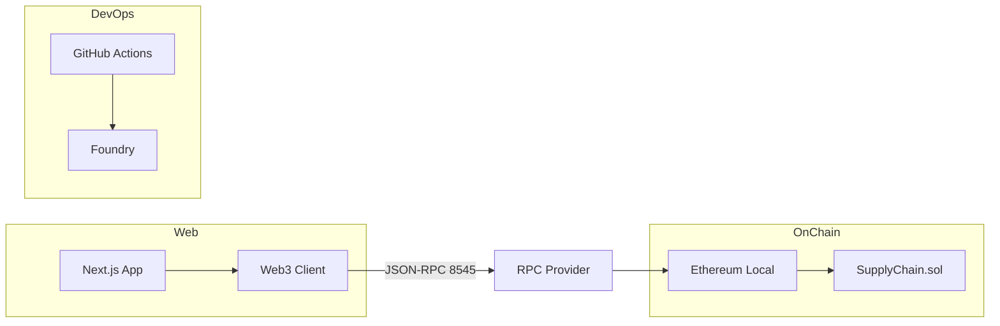
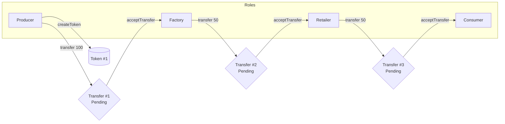

# PFM Traza 2025 — Supply Chain DApp

Monorepo con contratos inteligentes (Foundry) y frontend (Next.js) para trazabilidad y tokenización en la cadena de suministro.

## ¿Qué hace este proyecto?

- Gestiona la trazabilidad de productos mediante tokens con metadatos y árbol de parentesco (materias primas → productos).
- Controla transferencias entre roles con aceptación explícita del receptor (Pending → Accepted/Rejected).
- Administra el ciclo de vida de usuarios y sus permisos por rol (Producer, Factory, Retailer, Consumer, Admin).
- Ofrece una UI moderna en Next.js para operar la cadena y consultar el historial.

## Documentación

- Guía de despliegue y ejecución: [doc/DEPLOY.md](doc/DEPLOY.md)
- Estrategia de pruebas E2E: [doc/E2E_TEST_STRATEGY.md](doc/E2E_TEST_STRATEGY.md)
- Estrategia de pruebas de integración: [doc/INTEGRATION_TEST_STRATEGY.md](doc/INTEGRATION_TEST_STRATEGY.md)

## Demo en video

- Presentación y demo: [media/Presentacion.mp4](media/Presentacion.mp4)

## Estructura del proyecto

- Contratos (Foundry): `sc/`
- Web app (Next.js): `web/`
- Documentación: `doc/`
- Media: `media/`

## CI

- GitHub Actions ejecuta format/build/tests de Foundry en `sc/` para pushes y PRs: `.github/workflows/ci-foundry.yml`.

## Arquitectura (alto nivel)

## Flujo de tokens (resumen)

Reglas clave:
- Producer → Factory → Retailer → Consumer (flujo dirigido por rol).
- Cada transferencia queda en estado Pending hasta que el receptor la acepta/rechaza.
- Los balances por token y usuario se actualizan solo al aceptar.

## Roles y permisos (breve)

- Producer: crea tokens base, transfiere a Factory.
- Factory: recibe de Producer, puede derivar/transferir a Retailer.
- Retailer: recibe de Factory, transfiere a Consumer.
- Consumer: receptor final; no vuelve a transferir.
- Admin: aprueba/rechaza usuarios y supervisa el sistema.

## Contrato principal

- `sc/src/SupplyChain.sol`
  - Entidades: User, Token (con parentId y metadatos), Transfer.
  - Enums: `UserStatus` (Pending/Approved/Rejected/Canceled), `TransferStatus` (Pending/Accepted/Rejected).
  - Funciones: registro y aprobación de usuarios, creación de tokens, transferencias con aceptación, consultas de balances e historial.

## Desarrollo y pruebas

- Contratos
  - Formateo/compilación/tests: `cd sc && forge fmt && forge build && forge test -vvv`
  - Red local: `anvil` (Chain ID 31337)
- Frontend
  - `cd web && npm install && npm run dev`
  - Configura `web/src/contracts/config.ts` con `address` desplegada y `adminAddress` de Anvil.

## IA

- Conversaciones utilizadas durante el desarrollo:
  - [https://chatgpt.com/g/g-p-68f9037095c081919edbf776b80c0fb4-masterblockchain-pfm-1/shared/c/68f903ec-0780-8328-ba40-33c05e23429f?owner_user_id=user-h9x2Roc8cSYLp8kc8oyV5JaE](chat inicial con ChatGPT)
  - [doc/cursor_agent_chat_01.md](doc/cursor_agent_chat_01.md)
  - [doc/cursor_agent_chat_02.md](doc/cursor_agent_chat_02.md)
  - [doc/cursor_agent_chat_03.md](doc/cursor_agent_chat_03.md)
  - [doc/cursor_agent_chat_04.md](doc/cursor_agent_chat_04.md)
  - [doc/cursor_agent_chat_05.md](doc/cursor_agent_chat_05.md)

